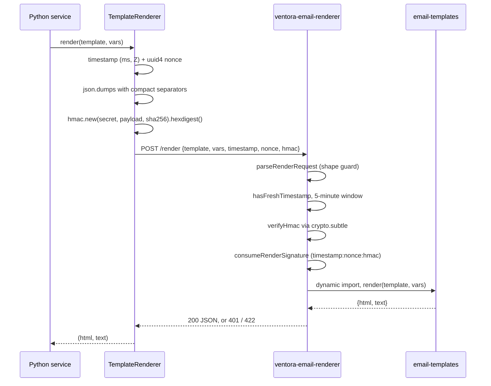
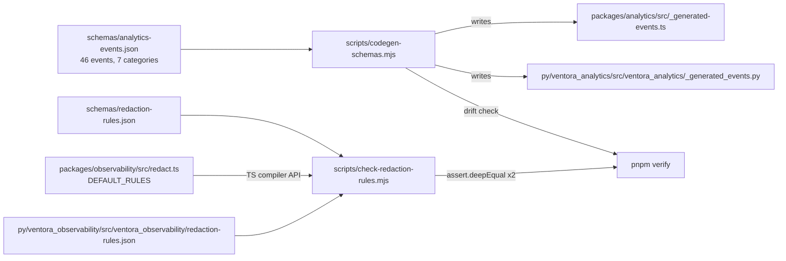

# Architecture: cross-language contracts

Part of the [ARCHITECTURE.md](ARCHITECTURE.md) series. This document covers claim 2: the Python
side owns no event names, no redaction regexes, and no email rendering, and borrows all three from
TypeScript: two by generated code, one over HTTP.

---

## 3. The Python-to-TypeScript render bridge

Email templates are React Email components. Python services need to send those emails and have no
JS runtime. Rather than maintain a second template set, `ventora_email` calls a Worker.



The two canonical payloads are written independently and must agree byte for byte. Python, at
`py/ventora_email/src/ventora_email/renderer.py:37`, emits keys in the order `timestamp, nonce,
method, path, body` with `separators=(",", ":")`. The Worker builds the same object literal in the
same order at `packages/email-renderer/src/index.ts:68`, and `JSON.stringify` produces the same
compact form. `scripts/e2e/email-renderer-bridge.e2e.mjs` exists to keep that agreement honest
across languages.

Verification uses `crypto.subtle.verify` rather than a string compare
(`packages/email-renderer/src/hmac.ts:16`), with a length and character-class guard first: a
digest that is not 64 lowercase hex characters is rejected before any key import.

`RENDER_HMAC_WINDOW_MS` is `5 * 60 * 1000` (`index.ts:18`) and covers both freshness and the nonce
map's own expiry. The map is a module-level `Map` and the code says plainly what that buys, at
`index.ts:19`:

> Best-effort isolate-local replay defense. Timestamp freshness remains the portable security
> boundary unless a shared Worker storage binding is added.

The AI Workers solved the same problem with a Durable Object. The renderer has not needed to, and
the comment records that gap instead of implying a guarantee the code does not make.

The Worker refuses to run unsigned in production. With no `RENDERER_HMAC_SECRET` and an
environment outside `local | development | test`, it returns 500 with `"Renderer HMAC secret is
not configured"` (`index.ts:133`). Only `POST /render` is routed; anything else is 405 or 404.

Python keeps what is genuinely Python. `py/ventora_email/src/ventora_email/__init__.py` exports
the Resend client, unsubscribe token generation and verification, and CAN-SPAM header helpers.
Rendering is the one thing it delegates.

---

## 4. Cross-language parity

Two contracts have to hold identically in both languages: the analytics event taxonomy and the
PII redaction rules. Neither is maintained twice by hand.



**Codegen, for event names.** `scripts/codegen-schemas.mjs` reads one schema and writes two files:
an `ApprovedEvent` string union plus an `APPROVED_EVENTS` object for TypeScript, and a
`Literal[...]` plus a tuple for Python. Both are emitted from the same `names` array, so a new
event cannot exist on one side only. The schema currently defines 46 events across 7 categories
(`auth`, `billing`, `error`, `feature`, `marketing`, `onboarding`, `support`), and the count is
stamped into the header comment of both outputs. In `--check` mode the script does a full string
comparison of the regenerated content against what is on disk and exits 1 with `DRIFT:` on any
difference (`codegen-schemas.mjs:87` to `99`). Python imports the result directly:
`py/ventora_analytics/src/ventora_analytics/__init__.py:1` re-exports `APPROVED_EVENTS`,
`ApprovedEvent`, and `VentoraProduct` from the generated module.

**AST extraction, for redaction rules.** Redaction is harder, because the TypeScript rules must be
inlined in `redact.ts` to keep `@ventora/observability` runtime-agnostic: no `fs`, no `fetch`, so
it works in a Worker (`redact.ts:17`). That means the same rule set exists in three places, and
none of them can import the others.

`scripts/check-redaction-rules.mjs` reconciles all three. It parses `redact.ts` with the
TypeScript compiler API, walks the statement list for the `DEFAULT_RULES` declaration, and
reconstructs its value with `readLiteralNode`. The reconstruction is strict on purpose: any node
that is not a string, boolean, array, or object literal throws `DEFAULT_RULES contains non-literal
node` (line 85). Nobody can quietly make the rules a computed expression that the checker can no
longer read.

Then `normalizeRules` sorts `fieldKeys` and sorts each pattern list by name, so ordering
differences between the authored TS literal and the two JSON files are not spurious failures,
and two `assert.deepEqual` calls compare the Python JSON and the extracted TS rules against the
schema. Today that is 35 field keys, 7 base patterns, 4 HIPAA-18 extensions, and 1 key pattern,
matched exactly by `py/ventora_observability/src/ventora_observability/redaction-rules.json`.

Because the two runtimes have different regex dialects, patterns are stored with an inline `(?i)`
prefix where case-insensitivity is needed. `buildPatternRegex` in `redact.ts:145` strips that
prefix and sets the JavaScript `/i` flag; Python's `re` reads it natively. Python loads its copy
from package data via `importlib.resources`, and falls back to the repo schema at
`Path(__file__).parents[4] / "schemas" / "redaction-rules.json"` for in-tree development
(`py/ventora_observability/src/ventora_observability/redact.py:27`).

**The gate.** Both scripts are wired into one npm script in the root `package.json`:

```json
"schemas:check": "node scripts/codegen-schemas.mjs --check && node scripts/check-redaction-rules.mjs"
```

and `schemas:check` is the first step of `pnpm verify`, ahead of `metrics:check`, `secrets:check`,
`test:scripts`, `lint:ci`, `typecheck`, `test:coverage`, and the two smoke suites. Drift fails the
build before a single test runs.

---

Continue with [ARCHITECTURE-RUNTIME.md](ARCHITECTURE-RUNTIME.md): Durable Object session state,
the CRM outbox retry ladder, and the two self-hosted package registries.
