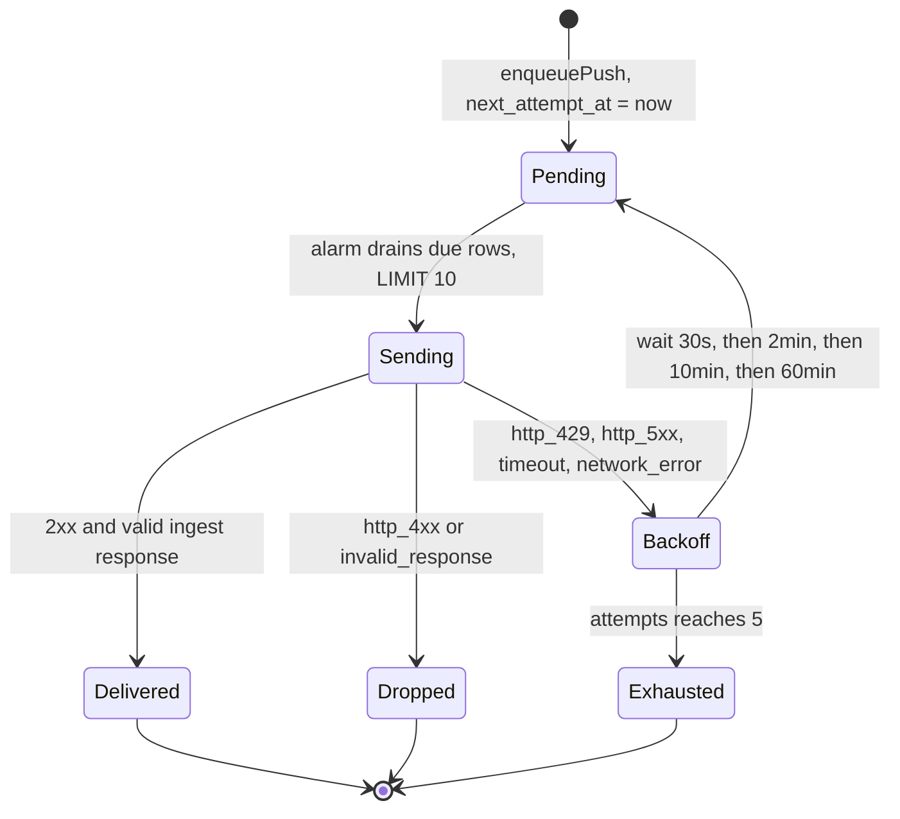

# Architecture: session state and the supply chain

Part of the [ARCHITECTURE.md](ARCHITECTURE.md) series. This document covers claims 3 and 4:
session state lives in Durable Objects with an alarm-driven retry ladder for side effects, and the
package supply chain is self-hosted end to end.

---

## 5. Session state and the durable outbox

Chat sessions live in Cloudflare Durable Objects (`AiSdrSession` and `AiCsSession`), each declared
as a SQLite-backed class in its Worker's `wrangler.toml` under `migrations.new_sqlite_classes`.
`ensureSchema` (`packages/ai-sdr-worker/src/index.ts:2483`) creates three tables and one index:

| Table | Purpose |
| --- | --- |
| `sessions` | `id`, JSON `payload`, `expires_at`; TTL default 86,400 s |
| `client_assertions` | the replay ledger from boundary one |
| `pending_pushes` | the CRM outbox: `attempts`, `next_attempt_at`, `last_reason` |

with `idx_pending_pushes_next_attempt` on `next_attempt_at ASC` so the drain query is a range scan
rather than a table scan.

Transcripts are stored raw, and the code explains why (`index.ts:2249`): the lead extractor reads
the transcript to capture a prospect's real email and phone. Redaction happens at the telemetry
boundary instead: `obsFor` at `index.ts:172` documents that `track` and `captureSentry` payloads
may carry only product ids, status enums, reason literals, score buckets, attempt counts, and
booleans.

### Why the outbox exists

A qualified lead has to reach the product's CRM. Doing that inline would put a third-party HTTP
call on the streaming path. Instead, `handleChat` defers extraction entirely to `waitUntil`
(`index.ts:940`), re-reading the session first so the extractor sees the assistant turn that was
just appended. If `waitUntil` is the no-op default, extraction is skipped rather than started
un-awaited (`index.ts:937`).

One consequence is visible in the protocol. Because a push finishes after the stream has closed,
`lead.captured` cannot be injected into that stream. It is emitted once at the start of the *next*
turn and then marked, at `index.ts:907` to `920`.

`pushLeadToCrm` (`packages/ai-sdr-worker/src/crm-push.ts`) never throws. It returns a
discriminated union and classifies failures into static, PII-free reason strings: `429` becomes
`http_429`, `>= 500` becomes `http_5xx`, both retriable; any other `4xx` is `http_4xx` and a
response body failing `isCrmLeadIngestResponse` is `invalid_response`, both terminal. An
`AbortSignal.timeout` firing at `DEFAULT_TIMEOUT_MS = 8_000` yields `timeout`; anything else from
`fetch` yields `network_error`.

Retriable failures land in `pending_pushes`, and the alarm drains them.



The ladder is a literal in `packages/ai-sdr-worker/src/constants.ts`:

```ts
export const PUSH_BACKOFF_MS = [0, 30_000, 120_000, 600_000, 3_600_000] as const;
```

indexed by attempts already made, with `PUSH_MAX_ATTEMPTS = 5` (`index.ts:146`).
`nextAttemptDelay` returns `null` once the budget is spent, and the caller deletes the row and
records `sdr_push_retry_exhausted`. That module exists separately from `index.ts` for a runtime
reason stated in its header: Wrangler's module-worker runtime rejects non-handler named exports
from the entry module, so shared constants cannot live there.

Four properties of the drain are worth calling out.

Every terminal path clears `leadPushPending` on the session (`index.ts:2367`, `2394`). Leaving it
set would permanently suppress future extractions for that visitor.

`scheduleNextAlarm` floors the next wake at `now` (`Math.max(Math.min(...candidates), now)` at
`index.ts:2417`) because a due-but-undrained row would otherwise schedule an alarm in the past and
busy-loop.

The drain is wrapped in its own `try/catch` inside `alarm()` (`index.ts:2286`) so a storage
failure cannot strand the object: TTL garbage collection and the reschedule still run.

Duplicate delivery is handled at the other end rather than with a distributed lock. The comment at
`index.ts:504` records the reasoning: the CRM ingest route is idempotent by `sdrSessionId`, so if
the Worker restarts between alarm ticks and the in-memory flag is lost, a second delivery upserts
instead of creating a second lead.

Model output that reaches a CRM body is capped at `MAX_CRM_FIELD_CHARS = 2_000` per free-text
field, so a runaway response cannot inflate the signed POST body or the persisted `payload_json`.

---

## 6. Self-hosted supply chain

Two more Workers close the loop. Neither depends on a third-party registry.

**`ventora-package-registry`** speaks enough of the npm protocol for `pnpm add` to work:
`GET /{name}` returns a packument, `GET /{name}/-/{tarball}` streams bytes from R2,
`PUT /-/ventora/packages` publishes, `GET /-/ping` is the health probe. Names must match
`/^@ventora\/[a-z0-9][a-z0-9-]*$/`. Publishing validates the tarball before anything is stored
(`packages/package-registry/src/index.ts:277`): the first three bytes must be the gzip magic
`0x1f 0x8b 0x08`, the computed `sha512-<base64>` must equal the declared `integrity`, and the
SHA-1 hex must equal the declared `shasum`. Both comparisons go through `timingSafeEqual`.

**`ventora-python-registry`** serves both halves of the modern PyPI simple API from one route.
`GET /simple/{name}/` returns PEP 691 JSON when the `Accept` header contains
`application/vnd.pypi.simple.v1+json`, and PEP 503 HTML otherwise, with `<meta
name="pypi:repository-version" content="1.0">` and each link carrying a `#sha256=` fragment
(`packages/python-registry/src/index.ts:496` to `546`). Uploads use the legacy multipart endpoint
that `twine` and `uv publish` already speak: `POST /legacy/` with `:action=file_upload`. The
Worker recomputes SHA-256 over the uploaded bytes and, when the client declared `sha256_digest`,
compares the two before accepting. Authentication accepts `Bearer` or `Basic`; for `Basic` it
takes the password component, because that is where `uv` and `pip` put the token
(`packages/python-registry/src/index.ts:236`).

Both registries make versions immutable using R2 conditional writes rather than a database. A
publish first claims the version key with `onlyIf: { etagDoesNotMatch: "*" }`; if the claim fails,
the request is a `409`. Concurrent publishes of *different* versions of the same package are
serialised by a per-package lock built the same way, with `PUBLISH_LOCK_TTL_MS` of `15 * 60 *
1000` and an acquisition loop of 25 attempts spaced 20 ms apart
(`packages/package-registry/src/index.ts:356`). A lock past its TTL is deleted and retried, so a
crashed publisher cannot block a package forever.

Both are configured for the same operational envelope in their `wrangler.jsonc`:
`"limits": { "cpu_ms": 50 }`, observability on at `head_sampling_rate: 0.01`, and one R2 binding
each.

---

Continue with [ARCHITECTURE-PACKAGES.md](ARCHITECTURE-PACKAGES.md): how the `@ventora/*` packages
layer on each other, and what this repository deliberately does not have.
