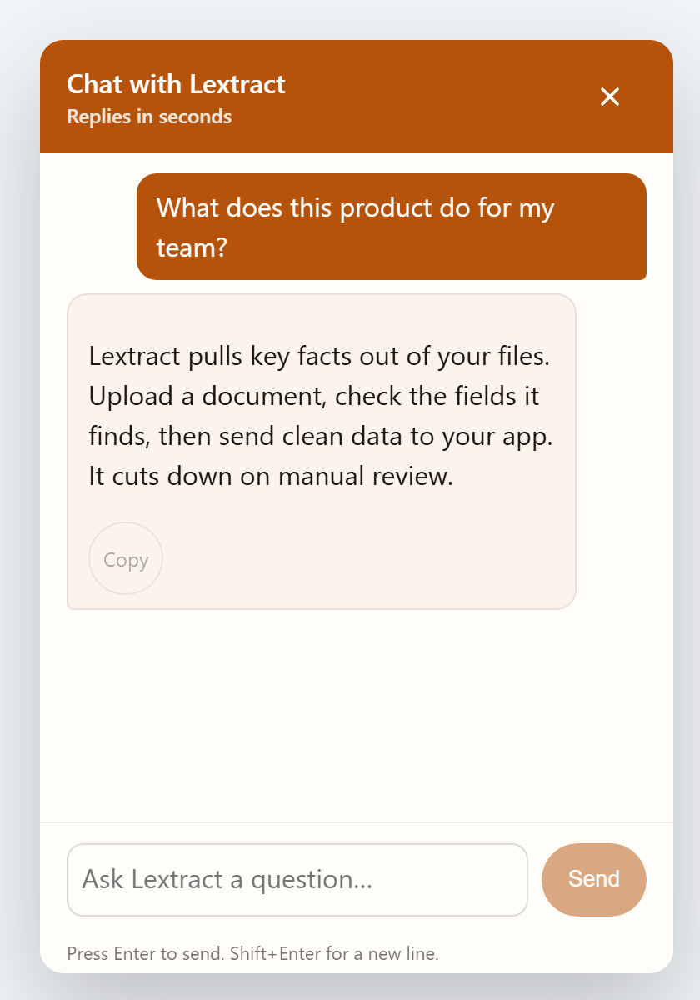
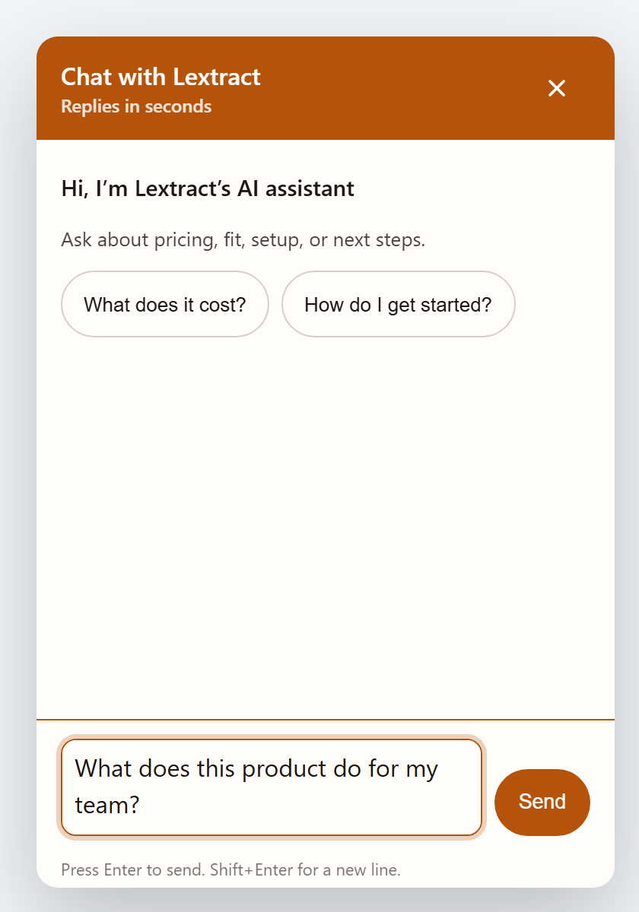
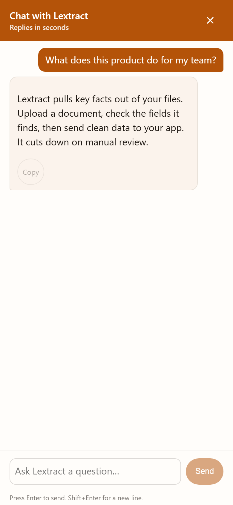
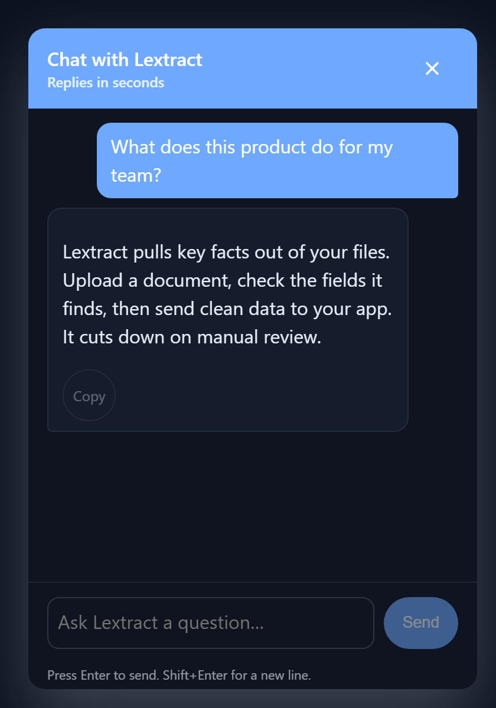
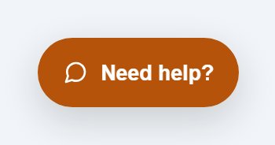
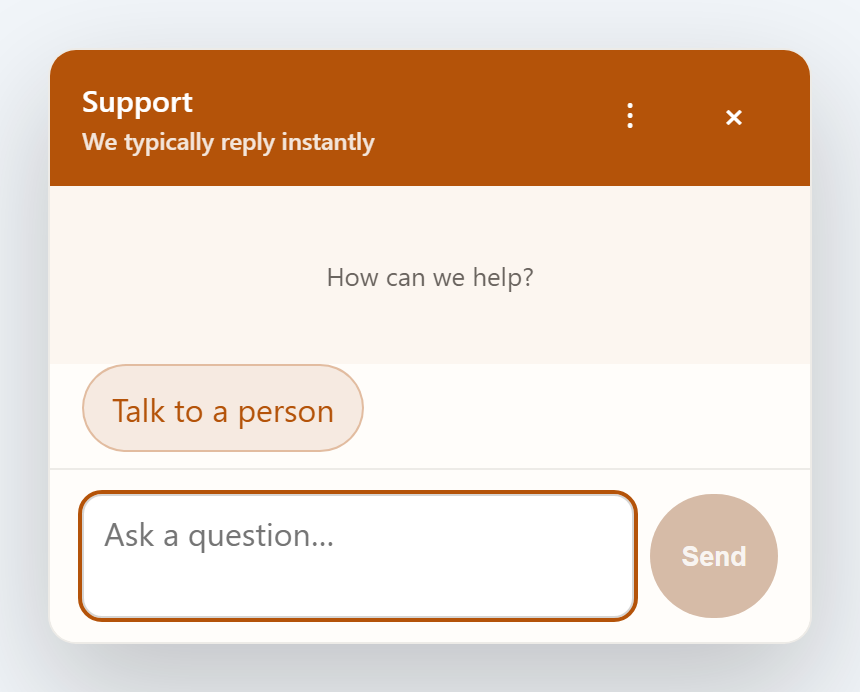
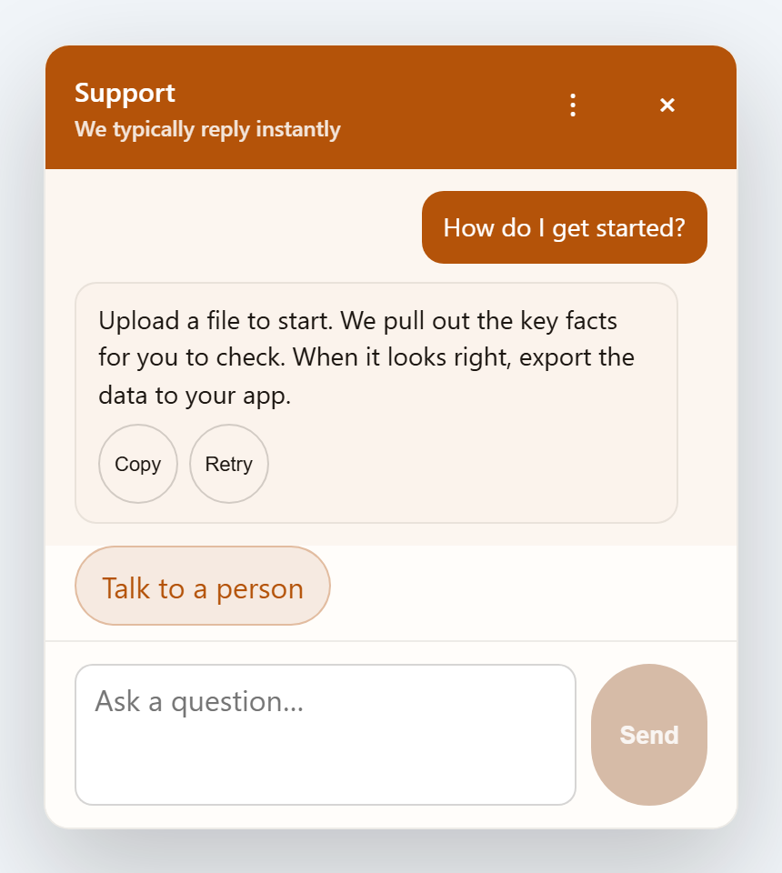
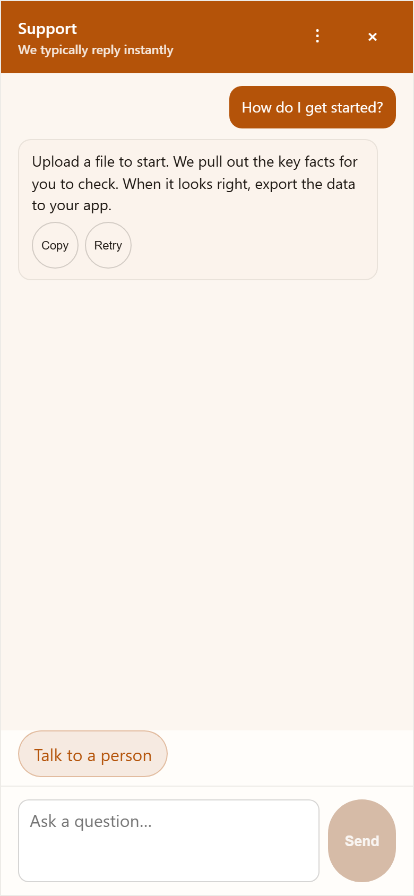
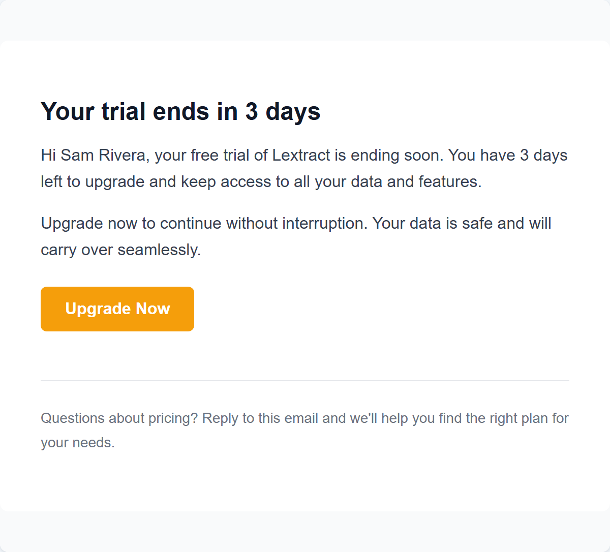
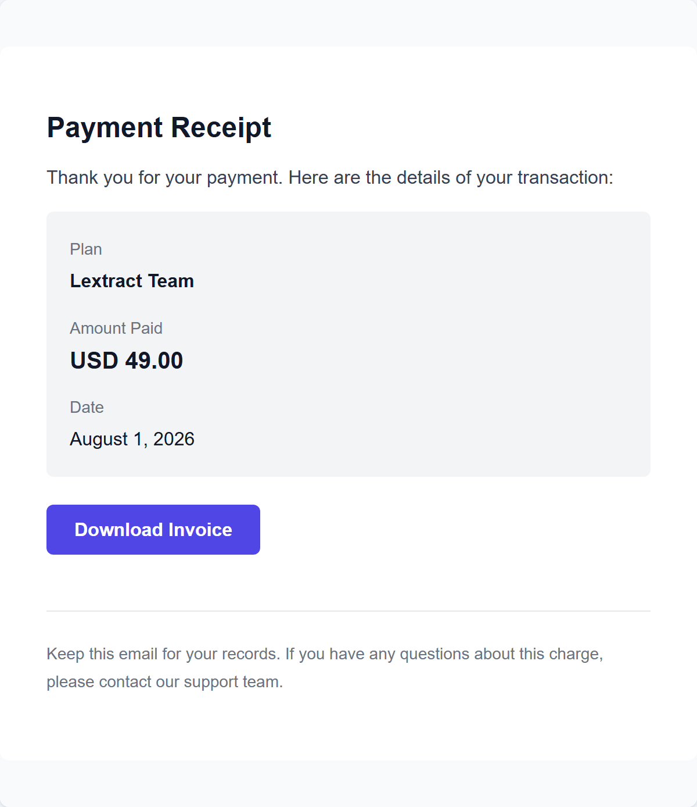

# Gallery

Everything under `portfolio/screenshots/` in one place. The README and the other documents pull a
few of these inline; the rest live here so the whole captured set stays visible.

Nothing here is a mockup. The widget shots come from the real hosted clients running against
`wrangler dev` Workers and a mock model server, with animations disabled immediately before the
shutter fires so no reply is caught mid fade-in; the email shots come from the real React Email
templates; the terminal shots are recorded stdout from the actual gates; and the charts are
generated from `docs/metrics.json`. The scripts that produce them are
`scripts/docs/capture-docs-shots.mjs`, `scripts/docs/render-email-previews.mjs`,
`scripts/docs/capture-terminal-svgs.mjs`, and `scripts/repo-metrics.mjs --charts`.

## System map

The one hand-drawn asset in the repository. Everything else is generated or captured.

## AI-SDR widget

The anonymous marketing assistant, served as a script from `@ventora/ai-sdr-worker` and injected
into the customer's own document with no shadow DOM.

<table>
<tr>
<td width="50%"></td>
<td width="50%"></td>
</tr>
<tr>
<td>Answered state. The reply streams in over SSE and carries a copy action.</td>
<td>Opening state with the greeting and two suggestion chips, and a question typed into the composer.</td>
</tr>
</table>

<table>
<tr>
<td width="50%"></td>
<td width="50%"></td>
</tr>
<tr>
<td>The same widget at a mobile viewport.</td>
<td>The same widget again, under a dark brand override. Colours come from per-product theme tokens, not a second stylesheet.</td>
</tr>
</table>

## AI-CS widget

The authenticated in-app support assistant, served from `@ventora/ai-cs-worker`.

<table>
<tr>
<td width="50%"></td>
<td width="50%"></td>
</tr>
<tr>
<td>The closed launcher.</td>
<td>The empty state, before any turn has been taken.</td>
</tr>
</table>

<table>
<tr>
<td width="50%"></td>
<td width="50%"></td>
</tr>
<tr>
<td>Answered state on desktop.</td>
<td>The same conversation at a mobile viewport.</td>
</tr>
</table>

### Four brands, one build

The same widget code under four brand themes. Brand tokens are data, so adding a product does
not fork the client. CAMAudit and CapVeri are the same product under its old and new names, so
these four themes correspond to three products.

## Email templates

Rendered by `@ventora/email-templates`. Python services reach these through the
`@ventora/email-renderer` Worker rather than running a JavaScript runtime.

Two of the ten at full width, from different layout families:

<table>
<tr>
<td width="50%"></td>
<td width="50%"></td>
</tr>
</table>

## Gates, recorded

Real stdout, rendered to SVG so it stays readable at any zoom and diffs as text. Two of these are
captures of a gate refusing bad input, which is the part worth seeing.

A single event added to `schemas/analytics-events.json` and nothing else. The byte-comparison
against the generated TypeScript and Python files catches it.

A fake OpenRouter key written into a tracked file. The scanner that runs inside `pnpm verify`
finds it.

`@ventora/ai-sdr-worker` is the largest package in the repository and excludes nothing from
coverage.

## Charts

Generated from `docs/metrics.json`, so they cannot drift from the numbers in the docs.

Lockfiles are excluded from the language chart and counted separately, which the caption inside
the image states as well.
