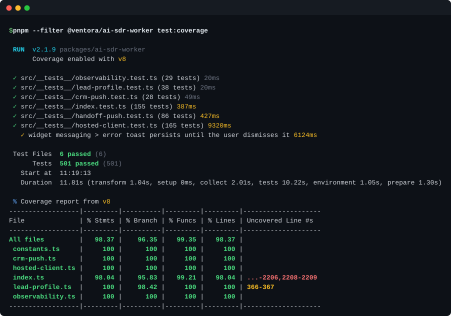
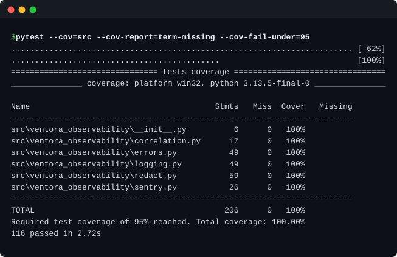
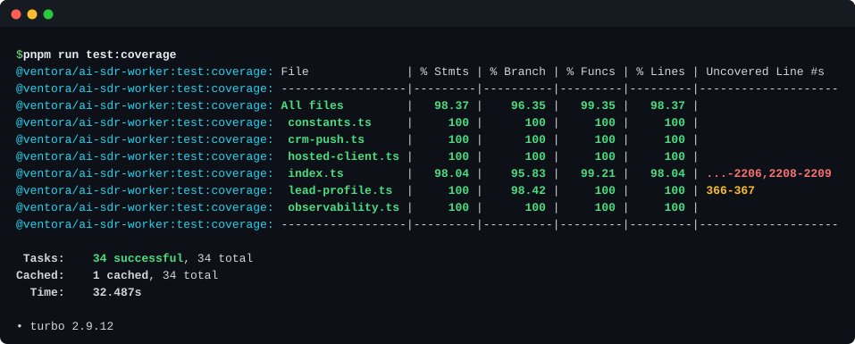
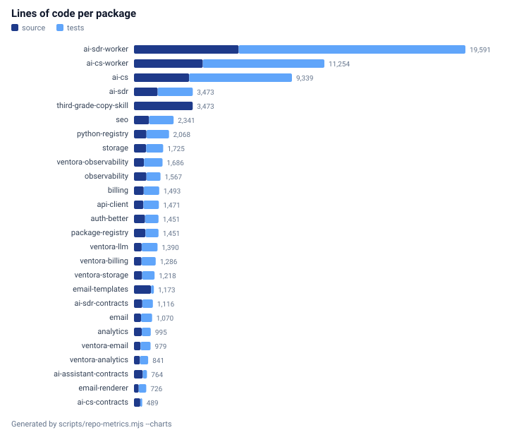
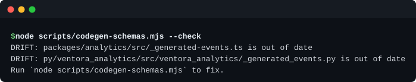
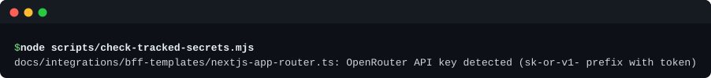

# Testing

This document exists to be argued with.

Most repositories claim high coverage and a strict gate. The claim is cheap because the reader
cannot check it. What follows is an attempt to make the claim checkable: which commands run, what
each one rejects, where the counts come from, and (the part that usually goes missing) what none
of it proves.

Every number below is read from `docs/metrics.json`, which is generated by
`scripts/repo-metrics.mjs` from the working tree. Nothing here is typed in by hand except the
prose around it. Release process, strictness settings, and the gate's own documentation-generation
pipeline live in [ENGINEERING-LOG.md](ENGINEERING-LOG.md); this document is the test and coverage
strategy specifically.

---

## Four test tiers

The repository runs four kinds of test. They are not interchangeable, and three of the four are
not part of the default gate. Both facts matter.

**Tier 1: vitest unit tests.** 2,059 declared cases across 61 TypeScript test files, and 448
declared cases across 24 Python test files. TypeScript source is 21,740 lines against 39,822 lines
of test; Python is 4,656 against 4,680. Run with `pnpm test:coverage` (TypeScript, via Turbo) and
`uv run pytest` from `py/`.

**Tier 2: `node:test` on the CI scripts themselves.** The scripts that enforce quality are code,
and code that is trusted without tests is just a longer way of trusting nobody. `pnpm run
test:scripts` runs 196 cases over ten files:

| File | What it covers |
| --- | --- |
| `scripts/__tests__/check-tracked-secrets.test.mjs` | secret-pattern matching and placeholder rejection |
| `scripts/__tests__/repo-metrics.test.mjs` | the counting rules behind every number in this document |
| `scripts/__tests__/term-svg.test.mjs` | ANSI-to-SVG rendering and the path scrubber that keeps machine paths out of published images |
| `scripts/run-affected-checks.test.mjs` | staged-change detection and per-package gate selection |
| `scripts/dev-workers.test.mjs` | local Worker boot, health-wait, and teardown |
| `scripts/ai-secrets-manifest.test.mjs` | the shape and completeness of `scripts/ai-secrets-manifest.json` |
| `scripts/e2e/client-assertion.test.mjs` | HMAC client-assertion signing used by the E2E harness |
| `scripts/e2e/mock-servers.test.mjs` | the mock OpenRouter and context servers |
| `scripts/e2e/mock-openrouter-sdr.test.mjs` | the SDR-specific mock model server |
| `scripts/e2e/browser-bff.test.mjs` | the browser-tier backend-for-frontend used in E2E |

**Tier 3: in-process E2E against real Workers.** `scripts/e2e/boot-e2e-workers.mjs` spawns actual
`wrangler dev` processes for `@ventora/ai-cs-worker` and `@ventora/ai-sdr-worker`, injects
E2E-only variables through `--var` (never through a committed file), and points them at
`scripts/e2e/mock-openrouter.mjs` and `scripts/e2e/mock-context.mjs`. The tests then speak HTTP and
SSE to a real Worker runtime rather than to a mocked module boundary. Entry point: `pnpm run
test:e2e`, covering `auth-contract.e2e.mjs`, `chat-sse.e2e.mjs`, `sdr-chat-sse.e2e.mjs`, and
`handoff-escalation.e2e.mjs`.

The boot script clears the plural `AI_*_CONTEXT_ENDPOINTS` variable on purpose, so a developer's
local `.dev.vars` cannot leak a production endpoint map into the harness. That kind of detail is
where E2E suites usually rot.

**Tier 4: Playwright browser E2E.** `scripts/e2e/browser-widget.e2e.mjs` and
`scripts/e2e/browser-sdr-widget.e2e.mjs` drive the embeddable widgets in a real browser against the
Tier-3 Worker stack. Separate entry points: `pnpm run test:e2e:browser` and
`pnpm run test:e2e:browser:sdr`.



*Real `pnpm --filter @ventora/ai-sdr-worker test:coverage` output for the largest package in the
repository.*

**What "declared" means.** Every case count above is a declared count, not a passing count, and the
distinction is precise rather than defensive. `scripts/repo-metrics.mjs` counts **declared** test
cases by parsing source, not by running anything. `countTestCases` strips comments and string
bodies, then matches `it`/`test` call sites including modifier chains. `countPytestCases` matches
module- and class-level `def test_*` and its `async` variant after stripping `#` comments.

That produces a number that is stable, cheap, and slightly wrong in a specific direction. Python
declares 448 cases; `uv run pytest` executes 472. The gap is `@pytest.mark.parametrize`, which
turns one declaration into several runs. The counting rule deliberately counts the declaration once
(the same choice it makes for `it.each` in TypeScript) because a parametrized case is one piece of
authored intent, and inflating it would flatter the number.

So: this document says *declared cases*. It never says *tests passing*. A count of declarations
tells you how much test intent exists in the tree. It does not tell you the suite is green right
now, and it should not be read that way.

The same caution applies in the other direction. `docs/metrics.json` reports 227 declared
`node:test` cases across the repository's JavaScript files; only 196 of those are wired into `pnpm
run test:scripts`. The rest live in E2E files that the default gate does not invoke. The larger
number is real and the smaller number is the one that runs, which is why the smaller number is the
one quoted above.



*`pytest --cov=src --cov-report=term-missing --cov-fail-under=95` for `ventora_observability`, a
single package, not the whole workspace.*

---

## The coverage floor, and why `perFile` is the load-bearing word

Nineteen vitest configs (one for each TypeScript package that has tests) each carrying the
identical line:

```ts
thresholds: { perFile: true, lines: 95, functions: 95, branches: 95, statements: 95 },
```

All six Python packages set `fail_under = 95` in their own `pyproject.toml` (`ventora_analytics`,
`ventora_billing`, `ventora_email`, `ventora_llm`, `ventora_observability`, `ventora_storage`).

`perFile: true` is the part that changes the meaning. Without it, a threshold is an average over
the package, and averages launder neglect: a 40%-covered file sits quietly next to a 99%-covered
sibling and the package still reports 96%. With `perFile: true` there is no sibling to hide behind.
Each file clears 95% on lines, branches, functions, and statements, or the package fails. Adding a
new file with no test is an immediate failure rather than a rounding error.

This is the strongest structural claim in the repository, so it deserves the strongest caveat: 95%
line coverage measures execution, not correctness. A file can be fully executed by tests that
assert almost nothing. Coverage catches the code you forgot to test. It does not catch the test you
forgot to write an assertion in.



*`pnpm run test:coverage` across the workspace, showing per-file rows rather than a package
average.*

---

## Coverage exclusions

Start with the number that is hardest to fake: **10 of the 20 TypeScript packages exclude nothing
at all** beyond build and test scaffolding. That set includes `@ventora/ai-sdr-worker` (6,192
source lines) and `@ventora/ai-cs-worker` (4,068), the two largest packages in the repository by a
wide margin. The code that handles live sessions, model streaming, HMAC verification, and CRM
handoff is held to the per-file floor with no carve-outs.

The rest of the exclusions are narrow and boring, which is the point. Barrel files (`src/index.ts`)
that only re-export. Type-only modules (`src/types.ts`). The generated `src/_generated-events.ts`,
which is machine-written and gated separately by `scripts/codegen-schemas.mjs`.
`@ventora/email-templates` excludes `src/templates/**`: React Email components whose output is
verified by rendered-snapshot review rather than by line coverage, which is a real gap and is named
here rather than buried.

Nineteen packages appear in the table, not twenty. The missing one is
`@ventora/third-grade-copy-skill`, which has no `vitest.config.ts` and therefore no coverage gate at
all. It packages a prompt skill whose logic lives in Python eval scripts. Listing it as "excludes
nothing" would have been true and dishonest, so it is called out here instead.

The table below is generated from every `vitest.config.ts` in the tree by
`scripts/repo-metrics.mjs`. It is not maintained by hand, so it cannot quietly fall out of sync
with the configs it describes.

<!-- metrics:coverage-config:start -->
| Package | Coverage exclusions beyond build and test scaffolding |
| --- | --- |
| `@ventora/analytics` | `src/_generated-events.ts`, `src/index.ts` |
| `@ventora/api-client` | `src/index.ts` |
| `@ventora/auth-better` | `src/index.ts`, `src/types.ts` |
| `@ventora/billing` | `src/index.ts` |
| `@ventora/email` | `src/index.ts` |
| `@ventora/email-templates` | `src/index.ts`, `src/templates/**` |
| `@ventora/observability` | `**/*.config.ts`, `src/index.ts` |
| `@ventora/seo` | `src/index.ts`, `src/types.ts` |
| `@ventora/storage` | `src/index.ts`, `src/types.ts` |
| `@ventora/ai-assistant-contracts` | none |
| `@ventora/ai-cs` | none |
| `@ventora/ai-cs-contracts` | none |
| `@ventora/ai-cs-worker` | none |
| `@ventora/ai-sdr` | none |
| `@ventora/ai-sdr-contracts` | none |
| `@ventora/ai-sdr-worker` | none |
| `@ventora/email-renderer` | none |
| `@ventora/package-registry` | none |
| `@ventora/python-registry` | none |
<!-- metrics:coverage-config:end -->



*Source and test lines side by side for every package, generated by
`scripts/repo-metrics.mjs --charts`.*

---

## Gates that reject

A screenshot of green checkmarks proves that a command exited zero. It does not prove the command
would ever exit non-zero. The only way to demonstrate a gate works is to feed it something bad and
watch it refuse.

`scripts/docs/capture-terminal-svgs.mjs` does exactly that for two of its five captures: it breaks a
file, runs the gate, records the failure, and restores the original bytes from an in-memory copy in
a `finally` block.



*The codegen gate rejecting injected drift, both the TypeScript and the Python generated file are
named, and the fix command is printed.*



*The secret scanner rejecting a planted OpenRouter key in a tracked documentation template.*

Both images show a non-zero exit. That is the whole point of including them.

---

## `pnpm verify`: the nine steps

Read straight from `package.json`:

```text
schemas:check && metrics:check && secrets:check && test:scripts
  && lint:ci && typecheck && test:coverage && smoke:ts && smoke:py
```

What each one rejects:

1. **`schemas:check`**: runs `codegen-schemas.mjs --check`, which regenerates
   `packages/analytics/src/_generated-events.ts` and
   `py/ventora_analytics/src/ventora_analytics/_generated_events.py` from
   `schemas/analytics-events.json` in memory and byte-compares against what is on disk. Then
   `check-redaction-rules.mjs` parses the TypeScript AST of `packages/observability/src/redact.ts`
   and deep-equals its default rules against both `schemas/redaction-rules.json` and the Python
   copy. Currently 46 analytics events and 35 redaction field keys, 7 patterns, and 4 HIPAA-18
   extensions have to agree across two languages.
2. **`metrics:check`**: recomputes every number in this document and its siblings from the working
   tree and fails on drift. See [ENGINEERING-LOG.md](ENGINEERING-LOG.md) for how the generator
   works.
3. **`secrets:check`**: scans every git-tracked file for OpenRouter key patterns, both the bare
   `sk-or-v1-` form and high-entropy `OPENROUTER_API_KEY=` assignments that are not recognized
   placeholders.
4. **`test:scripts`**: the 196 `node:test` cases over the CI scripts.
5. **`lint:ci`**: `biome check .` with no autofix, so a formatting drift fails rather than silently
   rewrites.
6. **`typecheck`**: `turbo run typecheck` across every package under the base strictness config
   (see [ENGINEERING-LOG.md](ENGINEERING-LOG.md)).
7. **`test:coverage`**: `turbo run test:coverage`, enforcing the per-file 95% floor.
8. **`smoke:ts`**: `pnpm --filter @ventora/ts-consumer test`, which imports the built packages
   through their published `exports` maps rather than through source paths. It catches a broken
   subpath export or a missing `.d.ts` that unit tests never touch, because unit tests import
   relative files.
9. **`smoke:py`**: `scripts/run-python-smoke.mjs`, which runs `uv sync --no-editable --reinstall`
   in `test-consumer/py-consumer` and then imports every `ventora_*` module and calls one function
   from each.

A pre-commit hook (`simple-git-hooks`) runs `lint-staged` plus
`node scripts/run-affected-checks.mjs`, which detects staged packages and runs only their gates:
build, typecheck, and coverage for TypeScript; ruff, mypy, and pytest for Python. It is a fast
subset, not a substitute for `pnpm verify`.

**No model is exercised against a real provider in any gate.** Tiers 3 and 4 use
`scripts/e2e/mock-openrouter.mjs` and `scripts/e2e/mock-openrouter-sdr.mjs`.
`scripts/e2e/live-openrouter.mjs` exists for real-model runs, costs money, and is never part of
`verify`. Prompt-behavior regressions are therefore only caught by whatever assertions the mock
servers encode.

**`pnpm verify` does not run any E2E tier.** Tiers 3 and 4 are separate commands (`test:e2e`,
`test:e2e:browser`, `test:e2e:browser:sdr`, `test:e2e:bridge`) because they need `wrangler dev`
processes and, for the browser tiers, installed Playwright browsers. They are run deliberately, not
on every commit. A change that passes `pnpm verify` has not been exercised end to end.

**`smoke:py` requires the `uv` toolchain.** `scripts/run-python-smoke.mjs` probes for `uv`, `python
-m uv`, and `py -m uv`, and exits 1 with an install message if none is available. The Python suite
is run with `uv run pytest` from `py/`. On a machine without `uv`, `pnpm verify` cannot complete.
The ninth step will not run, and the gate reports failure rather than skipping.

**Coverage thresholds bound the floor, not the ceiling.** 95% per file across four metrics is a
strong structural constraint and a weak semantic one. It guarantees the code was executed. It
guarantees nothing about what was asserted while it ran.

**The counts are declarations.** As set out above, they are parsed from source rather than observed
from a run. They describe how much test intent exists in the tree on the day
`scripts/repo-metrics.mjs` last ran.
